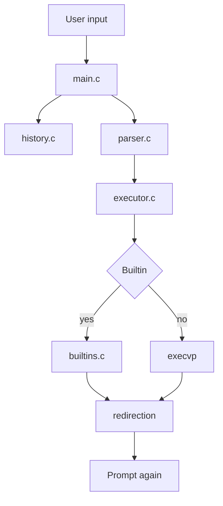

# Clix - A Custom Shell

Clix is a compact shell written in C. It implements a simple read-eval-print loop, parses each input line into a command structure, runs built-ins, executes external programs, stores history, and suggests corrections for misspelled commands.

## Project Overview

The shell is built around a single `Command` structure defined in [include/shell.h](include/shell.h). Each line of input flows through the same pipeline:

1. `main.c` prints the prompt and reads user input.
2. `history.c` stores the raw command.
3. `parser.c` turns the text into a `Command` object.
4. `executor.c` decides whether to run a built-in or launch an external process.
5. `builtins.c` handles shell commands like `cd`, `pwd`, `echo`, `exit`, `history`, and `help`.
6. `fuzzy.c` suggests similar commands when a command is misspelled.

## Features

- Command parsing for arguments and simple operators
- Built-in commands: `cd`, `pwd`, `echo`, `exit`, `history`, `help`
- External command execution through `execvp`
- Input and output redirection with `<`, `>`, and `>>`
- Background execution with `&`
- Persistent command history saved to `.mysh_history`
- Fuzzy suggestions for typos such as `lst` -> `ls`
- Prompt formatting as `user@hostname:cwd$`

## Code Walkthrough

### `main.c`

[`src/main.c`](src/main.c) contains the REPL loop. It ignores `SIGINT`, initializes history, prints the prompt, reads input with `fgets`, trims the newline, stores the line in history, parses it, executes it, and frees the command structure.

### `parser.c`

[`src/parser.c`](src/parser.c) converts raw text into a `Command`. It splits the line into tokens, recognizes `|`, `<`, `>`, `>>`, and `&`, expands `$VAR` environment references, and fills these fields:

- `args[]` and `argc`
- `input_file`
- `output_file`
- `append`
- `background`

### `executor.c`

[`src/executor.c`](src/executor.c) checks whether the command is a built-in. If it is, the shell runs it in-process; if not, it launches the command externally. The executor also applies redirection so built-ins such as `echo` can write to files just like external commands.

### `builtins.c`

[`src/builtins.c`](src/builtins.c) implements the shell’s built-ins directly:

- `cd` changes the current directory
- `pwd` prints the working directory
- `echo` prints its arguments
- `history` shows stored commands
- `help` prints built-in help text
- `exit` terminates the shell

### `history.c`

[`src/history.c`](src/history.c) keeps a fixed-size in-memory history buffer and saves it to `.mysh_history` on exit. On startup it reloads the file so previous commands remain available.

### `fuzzy.c`

[`src/fuzzy.c`](src/fuzzy.c) searches commands from `PATH` and compares them with the mistyped input using edit distance, prefix matching, and a small preference list. If a close match exists, the shell prints a suggestion.

### `utils.c`

[`src/utils.c`](src/utils.c) builds the prompt string. It shortens the home directory to `~` when possible and prints the prompt in the form `user@hostname:cwd$`.

## Execution Flow



## Module Map

- `main.c` drives the loop and coordinates the other modules.
- `parser.c` builds the `Command` structure.
- `executor.c` handles built-in dispatch, redirects, and external execution.
- `builtins.c` implements shell commands.
- `history.c` stores and reloads command history.
- `fuzzy.c` generates command suggestions.
- `utils.c` prints the prompt.

## Command Structure

```c
typedef struct Command {
    char           *args[MAX_ARGS];
    int             argc;
    char           *input_file;
    char           *output_file;
    int             append;
    int             background;
    struct Command *next;
} Command;
```

## Building And Running

### Build

```bash
make
```

If you are on Windows without `make`, you can build directly with:

```bash
gcc -Iinclude src/main.c src/executor.c src/parser.c src/builtins.c src/utils.c src/history.c src/fuzzy.c -o shell
```

### Run

```bash
./shell
```

## Supported Built-ins

| Command | Usage | Description |
|---------|-------|-------------|
| `cd` | `cd <path>` | Change directory |
| `echo` | `echo <args>` | Print text |
| `exit` | `exit [code]` | Exit the shell |
| `help` | `help` | Show available commands |
| `history` | `history` | Display command history |
| `pwd` | `pwd` | Print the current directory |

## Example Usage

```bash
$ pwd
/home/user/projects

$ cd /tmp
$ echo "Hello, Clix!"
Hello, Clix!

$ echo hello world >> file1.txt
$ cat file1.txt
hello world

$ ls -la &
$ history
$ lst
Did you mean: ls?
```

## Key Implementation Notes

- The parser is responsible for tokenizing input and separating operators from arguments.
- The executor applies redirection and decides whether to invoke a built-in or an external command.
- History is stored in memory and written to `.mysh_history` when the shell exits.
- Fuzzy matching keeps the shell friendly by suggesting likely commands when a typo is close enough.

## Development Notes

### Adding A New Built-in Command

1. Add the command check in `src/builtins.c`.
2. Implement the behavior in `run_builtin()`.
3. Update the help text if you want it documented in the shell.

### Extending The Parser

[`src/parser.c`](src/parser.c) is the main place to add new operators or token rules. Anything the parser emits must still fit the `Command` structure in [include/shell.h](include/shell.h).

## Project Summary

Clix is a small but complete shell implementation: it reads commands, parses them, keeps history, runs built-ins, launches programs, supports redirection, and helps correct typos. The code is intentionally split into small modules so each part of the shell is easy to reason about.
